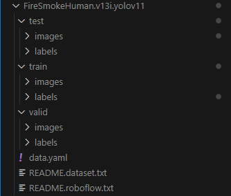

# indoor-outdoor-image-classifier
A CNN-based i​mage classifier​ capable of detecting if a scene is ​indoors or outdoors.

This repository contains scripts for downloading videos corresponding to a particular or a few categories of [youtube-8m dataset](https://research.google.com/youtube8m/index.html).

## Dependencies

1. Cài với môi trường Conda (Python 3.6)

```[bash]
conda create -n <tên môi trường> python=3.6
conda activate <tên môi trường>
pip install -r requirements.txt
```

2. Các bước chạy:

```[bash]
bash classify.sh config/train_params.yml <thư mục dataset>
python get_class_count.py
```

⚠️<span style="color: red;">Đường dẫn thư mục dataset nên ở dạng Roboflow để đọc được hết các ảnh trong từng thư mục train, test và valid.</span>

<div style="text-align: center;">
    
</div>

Python dependencies for the classification task

* Numpy
* Sklearn
* Tensorflow
* Keras
* tqdm
* PyYaml
* pytest

Dependencies for downloading youtube videos from ids

* [youtube-dl](https://github.com/rg3/youtube-dl#installation)

Dependencies for generation of frames from videos

* [ffmpeg](https://www.ffmpeg.org/download.html)

Dependences for image preprocessing and resizing

* [imagemagick](https://imagemagick.org/index.php)


## Install Python dependencies

```
 $ pip3 install -r requirements.txt
```

## Test the pre-trained model
This CLI will run the pretrained model on a provided image.

```
bash classify.sh config/train_params.yml data/test/indoor_test.jpg
```

### Download and extract the train/test data
An example dataset composed by 600 YouTube videos, for a total of 60.000 video frames, is availale [here](http://insidecode.it/indoor-outdoor-data_64.zip).
The videos belong to different category, according to the [youtube-8m dataset](https://research.google.com/youtube8m/index.html).

The dataset contains instances from the following categories, labeled as follows:
```
Living_room		indoor
Bedroom			indoor
Dining_room		indoor
Garden			outdoor
Outdoor_recreation	outdoor
Hiking			outdoor
```

Prepare the test environment downloading the provided dataset excerpt:

```
$ cd indoor-outdoor-image-classifier
$ wget http://insidecode.it/indoor-outdoor-data_64.zip
$ unzip indoor-outdoor-data_64.zip
```

### Evaluate the model on the test split
This will test the performance of the model on the test split and run a simple unit test on two benchmark images.

```
$ bash evaluate.sh config/train_params.yml indoor-outdoor-data_64/frames
```

### Train model

It is possible to tune the model parameters defining a new configuration file (following the default one in config/train_params.yml) and train the new model using the following command:

```
$ bash train.sh <config-file> <image-directory-path>
```
